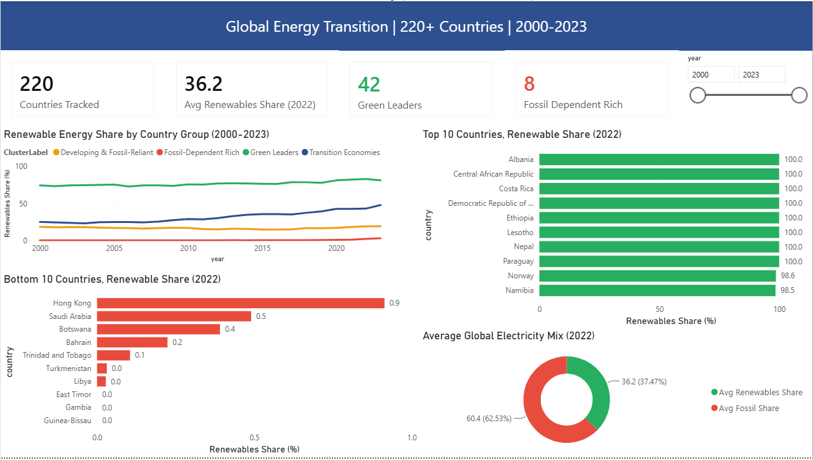
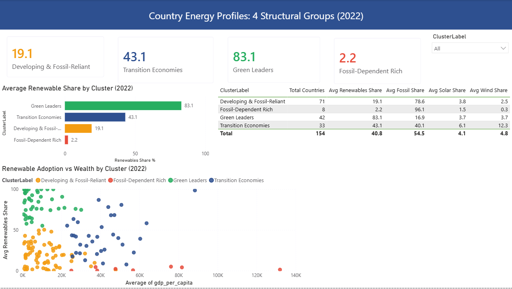
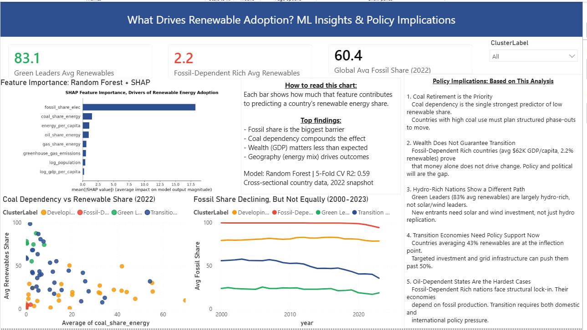

# Global Energy Transition Analysis

**Which countries are leading the energy transition, and what factors predict renewable energy adoption?**

This project analyzes energy data from 220+ countries spanning 2000 to 2023 using the Our World in Data global energy dataset. It combines exploratory data analysis, K-Means clustering, and a Random Forest model with SHAP explainability to identify structural country groups and the key drivers of renewable energy adoption.

---

## Business Question

Which countries are leading the global energy transition, and what economic and structural factors best predict a country's renewable energy share?

---

## Dataset

**Source:** Our World in Data — Energy Dataset  
**Coverage:** 220+ countries, 2000 to 2023  
**Key columns:** renewables share of electricity, fossil share of electricity, coal/gas/oil share of energy, GDP per capita, population, greenhouse gas emissions, electricity generation

The dataset was chosen for its breadth across geographies and time, and its inclusion of both economic and energy-mix variables that allow for meaningful cross-country comparison.

---

## Tools and Libraries

| Tool | Purpose |
|---|---|
| Python (pandas, numpy) | Data cleaning and feature engineering |
| matplotlib, seaborn | Exploratory visualization |
| scikit-learn | K-Means clustering, Random Forest, cross-validation |
| SHAP | Feature importance and model explainability |
| Power BI | Interactive 3-page dashboard |

---

## Project Structure

```
Global Energy Transition/
|-- Global_Energy_Transition_Analysis.ipynb   # Full EDA and ML notebook
|-- owid-energy-data.csv                      # Raw dataset
|-- energy_cleaned.csv                        # Cleaned dataset for Power BI
|-- shap_importance.png                       # SHAP feature importance chart
|-- PowerBI_Build_Guide.md                    # Dashboard build guide
|-- requirements.txt                          # Python dependencies
|-- README.md
```

---

## Analysis Summary

### Exploratory Data Analysis

The analysis filtered out aggregate regions (OWID aggregates) and focused on individual countries with data available for 2022. Log transformations were applied to GDP per capita and population to reduce skew. All snapshot analyses use 2022 as the reference year for cross-country comparisons.

Key observations:
- Green Leaders (primarily hydro-rich nations) have maintained 75 to 85% renewable share consistently since 2000
- Fossil-Dependent Rich countries (Gulf states and similar) show near-zero renewable share despite high per capita wealth
- Transition Economies show the steepest upward trend in recent years
- Global average renewables share reached approximately 36% in 2022

### K-Means Clustering (k=4)

Countries were grouped into 4 structural clusters using energy-mix and economic features. The optimal k was selected using the elbow method.

| Cluster | Countries | Avg Renewables Share | Avg Fossil Share | Profile |
|---|---|---|---|---|
| Green Leaders | 42 | 83.1% | 16.9% | Hydro-rich, low fossil dependency |
| Transition Economies | 33 | 43.1% | 40.1% | Mixed grid, rising renewables |
| Developing and Fossil-Reliant | 71 | 19.1% | 78.6% | Low income, high fossil dependency |
| Fossil-Dependent Rich | 8 | 2.2% | 96.1% | High income, near-zero renewables |

### Random Forest + SHAP Feature Importance

A Random Forest Regressor was trained to predict renewables share from structural country features (excluding data leakage variables). 5-fold cross-validation produced an R2 of 0.587, reflecting the inherent complexity of cross-sectional country-level data.

**Top SHAP features (in order of importance):**
1. fossil share of electricity (strongest negative predictor)
2. coal share of energy
3. energy per capita
4. oil share of energy
5. gas share of energy
6. greenhouse gas emissions
7. log population
8. log GDP per capita

GDP per capita ranked last, confirming that wealth alone does not drive renewable adoption.

---

## Key Findings

1. **Coal dependency is the single biggest barrier.** Countries with high coal share consistently show near-zero renewable share regardless of income level.
2. **Wealth does not guarantee transition.** Fossil-Dependent Rich countries average over $62K GDP per capita but only 2.2% renewables share.
3. **Green Leaders are mostly hydro-rich, not solar or wind leaders.** This means their path is not directly replicable by most developing nations.
4. **Transition Economies are at the inflection point.** At 43% average renewable share, targeted infrastructure investment could accelerate their transition significantly.
5. **Oil-dependent states face structural lock-in.** Their economies are built around fossil fuel production, making transition a political and economic challenge beyond just technology access.

---

## Power BI Dashboard

The interactive dashboard has 3 pages:

**Page 1: Global Overview**  
Scale and pace of the transition across 220+ countries, including trend lines by cluster, top and bottom 10 countries, and an electricity mix donut chart.

**Page 2: Country Clusters**  
K-Means story with cluster KPI cards, a cluster profile bar chart, a comparison table, and a GDP per capita vs renewables scatter plot.

**Page 3: What Drives Renewables?**  
SHAP feature importance visualization, coal vs renewables scatter, fossil share trend by cluster, and policy recommendations derived from the model.

### Dashboard Screenshots

**Page 1: Global Overview**  


**Page 2: Country Clusters**  


**Page 3: What Drives Renewables?**  



---

## Author

**Somto Ogene**  
Data Analyst | Python, SQL, Power BI, Tableau  
[LinkedIn](https://linkedin.com/in/ogenesomto)
